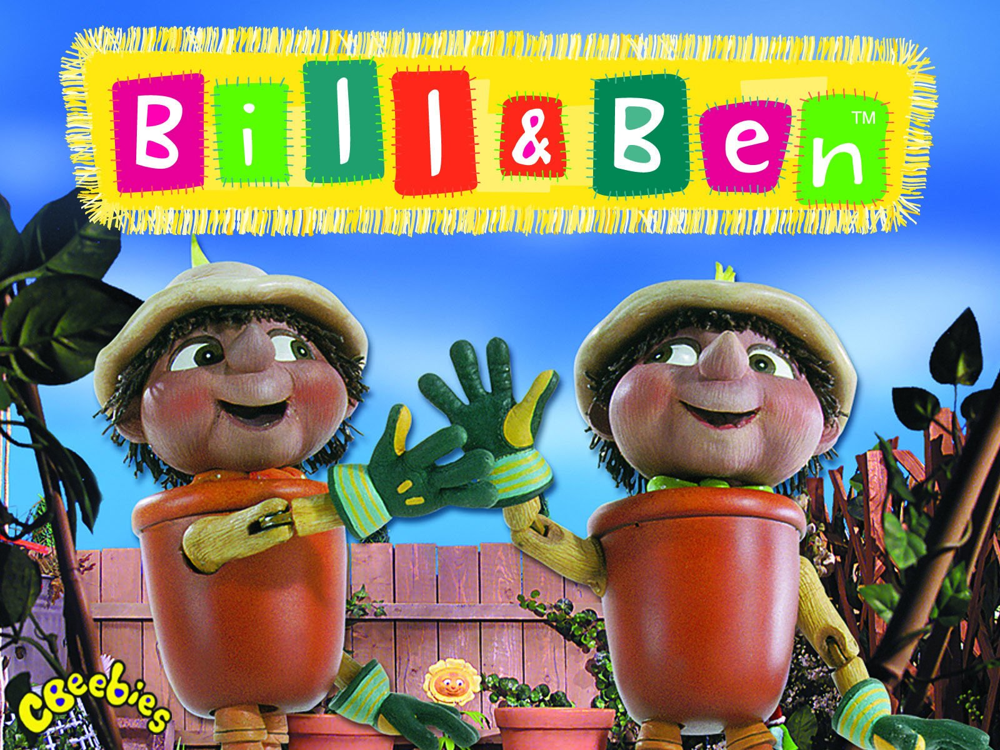

# Website Description

Based in Bristol, Bill and Ben are operating a new, ethically sourced clothing store. They aim to provide a series of culturally diverse clothing to people of all ages. Raised in urban Bristol, spending their lives amongst flowers and surrounded by a host of different cultures and ideals, they require a website that draws inspiration from different sources, utilises a striking colour scheme and is otherwise visually interesting to look at. In this way the website will reflect the clothing brand. Bill and Ben are adamant believers in removing social boundares and thus place a focus on androgynous clothing that fits both men and women. They would like both their equal rights ideals and ethically sourced products to be mentioned in a fun slogan at the start of the website.

## Required Features (Tasks)
1. Shopping Basket
2. Popular/Recommended Items
3. Opening Hours
4. Location
5. (Optional) About Page
   * This can be any page of your choosing, however, it is not complusory
6. New Arrivals
7. Filter for ages and styles

## Website Example
1. [KOMODO](https://www.komodo.co.uk/)
2. [People Tree](https://www.peopletree.co.uk/)

